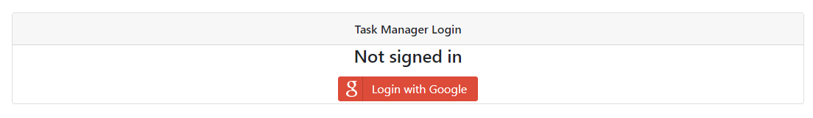
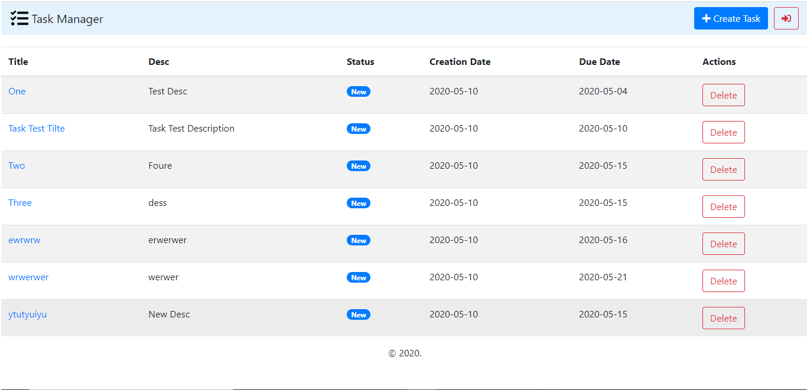
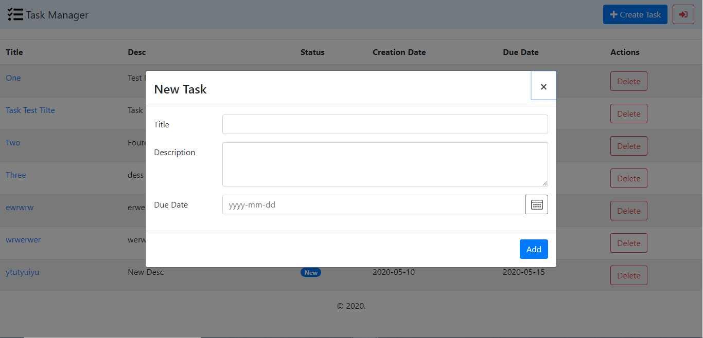
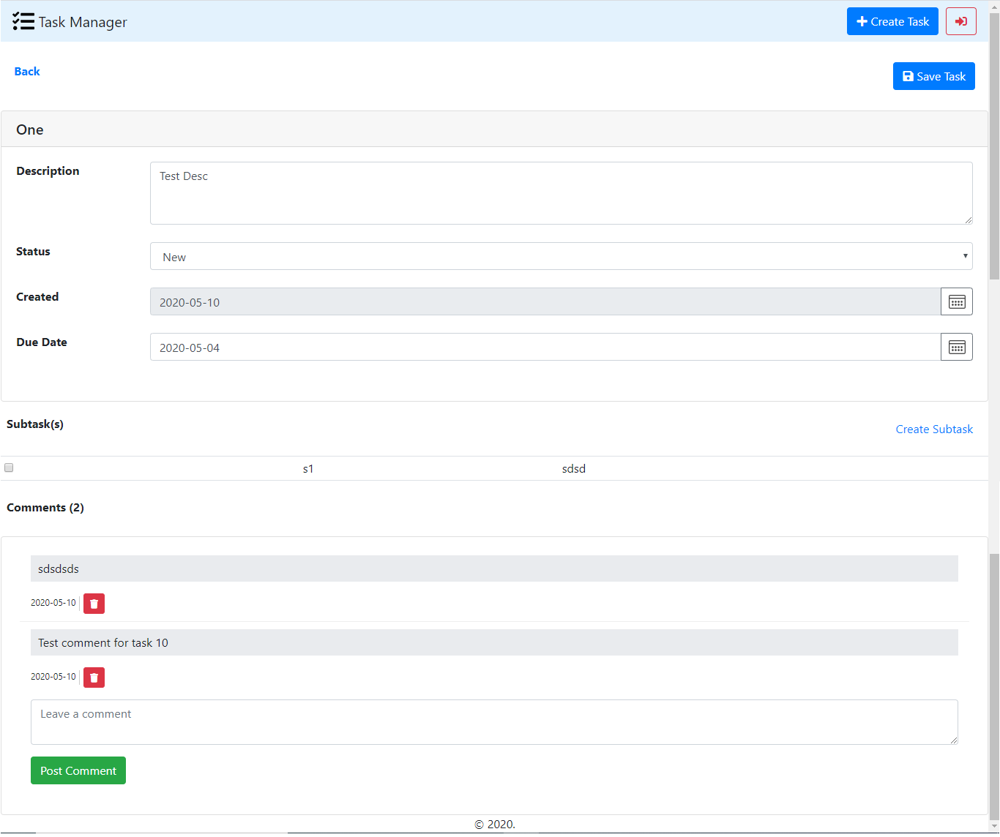

# TaskManagerApp

## Prerequisite
- Create DB from `/db/db.sql` file
- Change db `config` details in `task-manager-server/config/default.json`
- Run `npm install` from `root` folder of application
- `npm run bootstrap` to `hoist` all project dependencies

## Start
- `npm run start:server` to start the `server`
- `npm run start:client` to start the `client`

## Code Beautification
- `npm run prettier:client:ts` for `client` beautification
- `prettier:server:js` for `server` beautification
## Test
- `npm run test:server-cov-html` to run the test coverage of `server`. 
- `coverage.html` file will be generated in `task-manager-server` root folder

## Technology Stack
### Server(Nodejs)
- hapi
- sequelize (ORM)
### Client
- Angular 9
- Obeservable Store
- Prettier
### DB
- postgresql
### Test Coverage
- Client [TBD]
- Server - `>90%`
  - [Coverage Report](projects/task-manager-server/coverage.html)

## Bundle Analyzer
[App Bundle Analyzer Report](output/Analyzer.png)

## Performance checklist
[Angular Performance checklist](https://github.com/mgechev/angular-performance-checklist)

## Screens
- Login

- Task List

- Add Task

- Task Details

